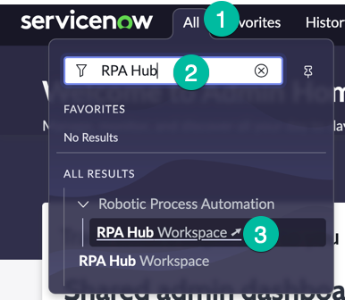
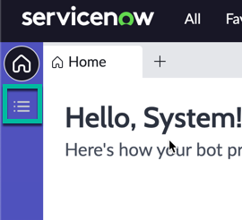
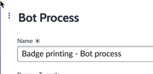
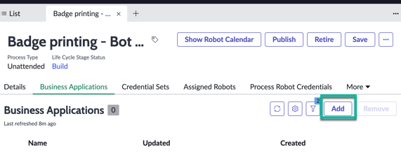
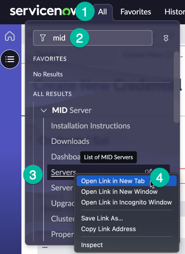

Na próxima etapa, realizaremos algumas tarefas administrativas dentro do Espaço de Trabalho do RPA Hub para ajudá-lo a se familiarizar com as várias configurações disponíveis. Faça login na instância atribuída a você usando as credenciais de administrador que recebeu ao reivindicar essa instância.

Clique em **Todos** (1), depois digite **RPA Hub** no filtro de navegação (2) e clique em **Espaço de Trabalho do RPA Hub**

O Espaço de Trabalho do RPA Hub é onde você pode governar, gerenciar e supervisionar sua força de trabalho digital, tudo em um só lugar.

No canto superior esquerdo, clique no ícone 'hambúrguer' para acessar as listas disponíveis

Clique em **Processo do Bot** (1), depois vá para **Atribuir Configuração** (Clique na pequena seta ao lado de **Criar Configuração**).

Estamos agora criando um novo **Processo do Bot** a partir de uma **configuração do processo do bot** existente e, em seguida, preencheremos os campos restantes necessários

Marque a caixa (1) para selecionar o registro de **Configuração do Processo do Bot de Impressão de Crachás** e clique em **enviar** (2)

> O registro de Configuração do Processo do Bot de Impressão de Crachás foi pré-carregado nessas instâncias de laboratório para economizar tempo, permitindo-nos nos concentrar rapidamente na construção do robô. Esses registros de configuração são valiosos para clientes com várias instâncias que precisam exportar configurações de uma instância para outra.

Esta aba deve abrir no espaço de trabalho, mostrando o registro do processo do bot. Atualize o campo **Nome** (1) para renomear o Processo do Bot, remova a configuração e clique em **Salvar** (2)

Você deseja que o campo **nome** do Processo do Bot fique conforme mostrado:

Agora que temos o novo registro do Processo do Bot de Impressão de Crachás criado, vamos preencher alguns campos importantes. Clique na aba **Aplicações de Negócio**

> Nota: Este aspecto da configuração é de extrema importância. Na aba Aplicação de Negócio, estabelecemos uma relação entre o Processo do Bot e a automação RPA que estamos criando, conectando-o à Aplicação de Negócio específica que estamos automatizando. Essa configuração é armazenada no CMDB (Banco de Dados de Gerenciamento de Configuração), permitindo que os clientes mantenham sua equipe de Automação informada ao planejar mudanças nessas aplicações de negócios. Considere um cenário onde uma equipe está modificando a IU do Aplicativo de Badging enquanto outra equipe está automatizando-o. Outra vantagem de manter essa relação no CMDB é que, quando ocorre um incidente nesse aplicativo, ele pode ser correlacionado com erros potenciais na automação. Imagine se o aplicativo de negócios falhar; os robôs RPA podem parar de funcionar. Ter visibilidade sobre possíveis causas raiz pode ser extremamente valioso."

Clique em **Adicionar** para mapear a Aplicação de Negócio existente (do CMDB) para o Processo do Bot

Selecione a **Impressão de Crachás** (1) Aplicação de Negócio e clique em **Adicionar** (2)

Se você não ver a Aplicação de Negócio após adicioná-la, clique no botão de Atualizar conforme mostrado

e você deve vê-la na aba Aplicação de Negócio conforme mostrado

Vamos continuar com a configuração do processo do bot. Clique na aba **Conjunto de Credenciais** (1), depois clique em **Novo** (2)

Mantenha essa aba aberta; precisamos recuperar informações adicionais que usaremos nesses campos

Precisamos obter o hostname da Máquina Virtual Windows que foi atribuída a você. Curiosamente, é a mesma máquina que o MID Server implantado com sua instância

Clique em **Todos** (1), depois digite **mid** (2) no filtro de navegação, passe o mouse sobre **Servidores** e clique com o botão direito em **Abrir Link em uma nova Aba** (apenas para manter a página do processo do bot aberta)

Na nova aba, copie o valor que você vê na coluna **Nome do Host** como mostrado para sua área de transferência. Além disso, anote o hostname, pois usaremos esse valor ao criar o registro do Robô.

Em seguida, volte para a aba Conjunto de Credenciais no espaço de trabalho do RPA

No campo **Nome**, cole o valor copiado anteriorme
