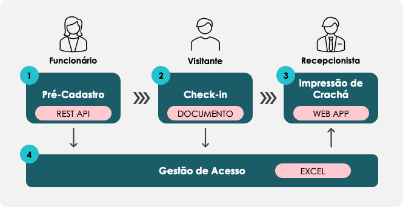

## Objetivo

Neste laboratório, automatizaremos o processo de acesso de visitantes utilizando as principais capacidades de hyperautomação e Low Code da ServiceNow cobrindo Integration Hub, Document Intelligence (DocIntel) e RPA Hub em um só laboratório. Além disso, criaremos uma aplicação unificada no App Engine para gerenciar todo o fluxo, desde o pré-cadastro de visitantes até a impressão de crachás, garantindo eficiência e modernização de sistemas legados.

## Caso de Uso

A ACME Inc. busca modernizar e automatizar seu processo de "Acesso de Visitantes" para reduzir erros, melhorar a experiência dos visitantes e oferecer uma interface unificada para os funcionários. O cenário atual apresenta desafios relacionados à integração de sistemas legados e à validação de informações de visitantes, o que resulta em atrasos e inconsistências.

## Cenário Atual
O processo atual da ACME Inc. é composto por:
- Pré-cadastro de visitantes em um sistema legado.
- Validação manual de informações de identidade no momento do check-in.
- Registro e impressão de crachás em um sistema que requer interação manual e propenso a erros.

## Solução

Este laboratório guiará você na construção de uma solução moderna e integrada para resolver esses problemas, permitindo uma experiência eficiente e sem falhas para visitantes e funcionários.

Os requisitos incluem:
1. **Pré-Cadastro de Visitantes**: Consumir informações de visitantes já cadastrados em um sistema externo, disponibilizadas via API que será integrada ao ServiceNow utilizando um spoke do Integration Hub.
   
2. **Check-in de Visitantes**: No momento da chegada, o visitante realizará o check-in em totem de auto digitalizando seu documento de identidade com DocIntel. Os dados extraídos serão validados frente a uma API externa, utilizando fluxos do Integration Hub.

3. **Impressão de Crachás**: Uma interface moderna permitirá aos funcionários da recepção registrar visitantes no sistema de impressão de crachás. Como este sistema não possui APIs, utilizaremos RPA para automatizar a interação com o sistema legado a partir do portal do ServiceNow.

4. **Gestão Centralizada**: Todo o processo será gerenciado em uma aplicação única no App Engine, incluindo dashboards para monitorar registros, check-ins e impressões de crachás.

