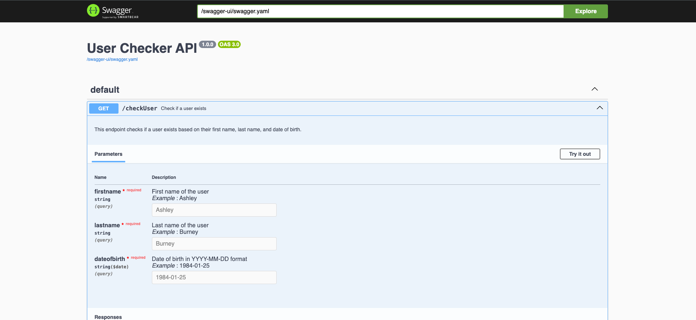
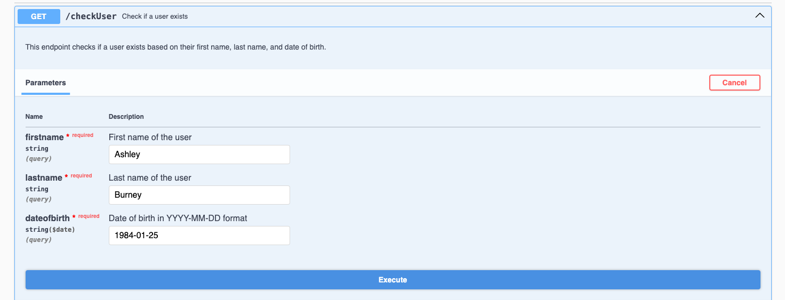
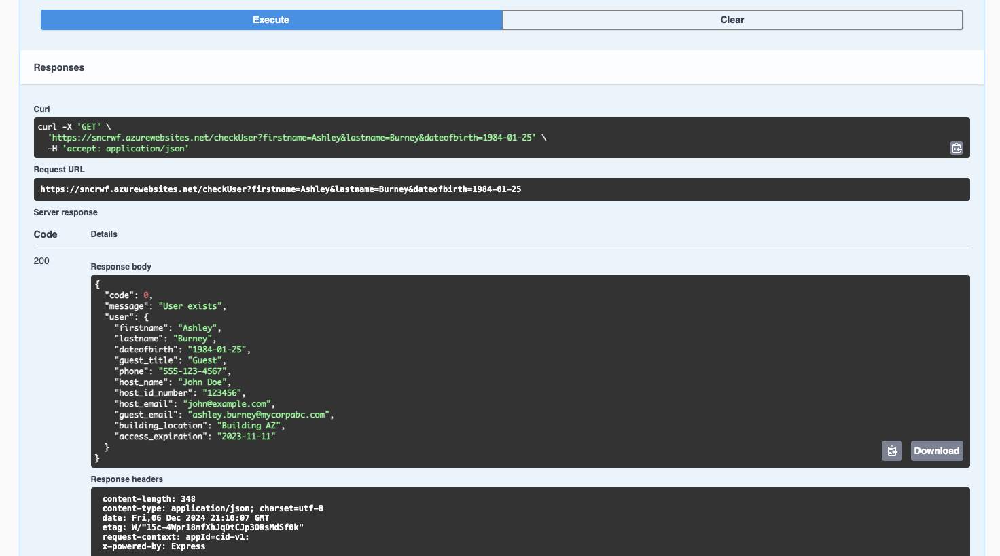
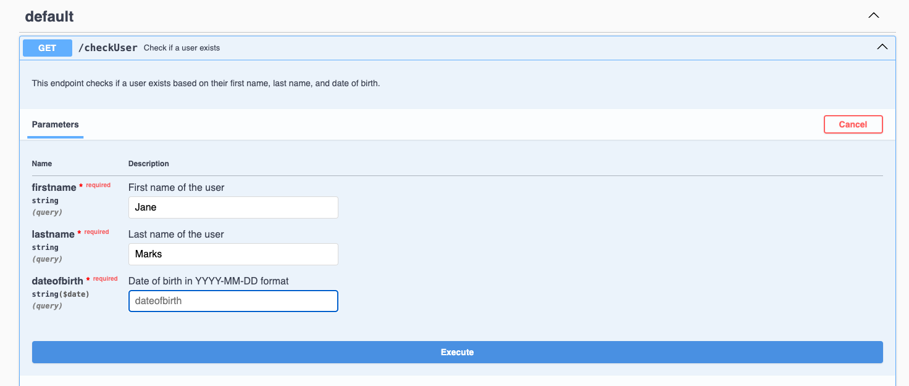

Agora iremos revisar as como o processo é realizado atualmente e sistemas utilizados para controlar o acesso dos visitantes. Aproveite para entender os aspectos técnicos de cada etapa.

---

## 1. Controle de Acesso - Planilha Excel

Atualmente, o time de recepção utiliza uma planilha no Excel para registrar e monitorar o acesso de visitantes às instalações da empresa. Esse método, embora funcional, apresenta limitações significativas, como dificuldade de acesso em tempo real, falta de automação e maior propensão a erros humanos durante a entrada de dados.

A planilha é utilizada para:
- Registrar informações básicas dos visitantes, como nome, e-mail e data de nascimento.
- Acompanhar o status de check-in e validade do acesso.
- Manter um registro do host responsável por cada visitante.

Abaixo está a estrutura principal da planilha, que iremos revisar para criar a solução no ServiceNow:

| Campo                | Descrição                                                    |
|----------------------|--------------------------------------------------------------|
| Access Expiration    | Data de expiração do acesso do visitante                     |
| Building Location    | Local do edifício onde o visitante será recebido             |
| Guest Email          | E-mail do visitante                                          |
| Guest Title          | Título ou classificação do visitante                         |
| Host Name            | Nome do host responsável                                     |
| Guest Phone          | Telefone do visitante                                        |
| Visitor Date of Birth| Data de nascimento do visitante                              |
| Visitor First Name   | Primeiro nome do visitante                                   |
| Visitor Last Name    | Último nome do visitante                                     |

Essa estrutura será transformada em uma tabela dentro da plataforma ServiceNow.

### Planilha de Controle Excel

Vamos abrir a planilha para verificar sua estrutura e dados históricos. Acesse o conteúdo descompactado do laboratório e abra o arquivo `Visitors.xlsx`


**Desafios da Planilha:**
- **Manutenção Manual:** A inserção de dados é feita manualmente, o que consome tempo e aumenta o risco de inconsistências.
- **Falta de Automação:** Não existem notificações automáticas ou integração com outros sistemas de acesso.
- **Acesso Restrito:** Apenas um número limitado de pessoas consegue acessar e editar o documento ao mesmo tempo.

**Próxima Etapa:**
Substituiremos esta planilha por uma aplicação centralizada no **ServiceNow**, que incluirá:
- Fluxos automatizados para registro e validação de visitantes.
- Dashboards e relatórios para monitorar o ciclo de vida de cada visitante.
- Integração com o processo de check-in e impressão de crachás.

Esta transição para uma aplicação no ServiceNow proporcionará maior eficiência, visibilidade em tempo real e uma experiência aprimorada para visitantes e funcionários.

## 2. Pré-Cadastro de Visitantes - Rest API

A API de pré-cadastro de visitantes é relativamente simples, consistindo em apenas um método chamado `checkUser`. Esse método requer três entradas:

| Campo       | Tipo      |
|-------------|-----------|
| firstname   | string    |
| lastname    | string    |
| dateofbirth | YYYY-MM-DD |

Ao fornecer as informações do usuário, a API retornará uma mensagem indicando se um usuário existe ou não. Caso o usuário exista, serão fornecidas informações adicionais que poderão ser utilizadas em um fluxo de trabalho no ServiceNow.

**Exemplo de Resposta da API:**

```
{
  "code": "0",
  "message": "User exists",
  "user": {
    "guest_title": "Guest",
    "phone": "123-456-7890",
    "host_name": "Jane Smith",
    "host_id_number": "987654",
    "host_email": "jane@example.com",
    "guest_email": "john@example.com",
    "building_location": "Building A",
    "access_expiration": "2023-12-31"
  }
}
```

**Testando a API:**
1. Utilize a documentação OpenAPI Swagger: **User Checker API**.

    

2. A documentação oferece dados de teste prontos. Clique em **Try it out** e depois em **Execute** para testar.

    

3. Verifique a estrutura da resposta e os campos retornados.

    

4. Teste outros valores clicando em **Clear** e repetindo os passos anteriores.

    

---

## 3. Impressão de Crachá - Web

A aplicação de impressão de crachá é um sistema legado baseado na web, que não possui APIs disponíveis. Por isso, o RPA será a solução ideal para automatizar esse processo sem a necessidade de alterações no sistema existente.

**Acessando a Aplicação:**
1. De um navegador da web, abra a aplicação **ACME Inc. - Badging & Authorization** para acessar o aplicativo de badging.
2. Você verá a tela de autenticação abaixo:

    

3. Digite as seguintes credenciais para autenticar e clique em **Enviar**:

    | Campo    | Valor         |
    |----------|---------------|
    | Username | badgeadmin    |
    | Password | badgeadmin    |

4. Após autenticar, você verá a página utilizada pelos agentes de segurança para imprimir crachás:

    

**Automação com RPA:**
No projeto de automação, as seguintes etapas serão automatizadas:
- Abrir o navegador da web.
- Autenticar no sistema utilizando as credenciais fornecidas.
- Realizar a entrada de dados do visitante no formulário.
- Enviar o formulário para gerar o crachá.

Essa automação elimina erros manuais e melhora a eficiência operacional, proporcionando uma experiência mais fluida para visitantes e funcionários.

