## Visão Geral

A aba **Forms** no Table Builder é o seu espaço para criar, configurar e personalizar visualmente as visualizações de formulário para seus **fulfillers** sem a necessidade de navegar entre diferentes ferramentas.

Neste exercício, focaremos na criação de um novo formulário padrão exclusivo para a tabela `Visitantes`.

Esta visualização de formulário é a visualização 'back-end' que será visível na Plataforma para os **fulfillers** que trabalham nos Casos de Teletrabalho.

Os **fulfillers** pediram que os seguintes campos fossem adicionados ao formulário:
* Host ID
* Host Email
* Host Location

Porém temos um desafio, a nossa tabela não possui os campos esses campos. A seguir você irá a aprender a realizar um conceito chamado de "Dot-Walk" que irá permitir adicionar campos por meio do relacionamento de tabelas.

## Instruções

1. Clique no botão **Forms** no centro da página.
   
   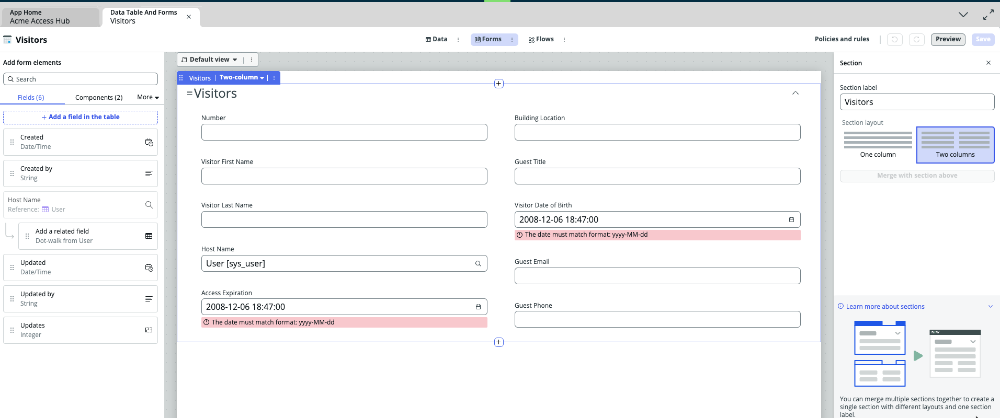

2. **Adicione o campo 'Host ID' ao formulário.**
   1. Passe o cursor sobre o campo 'Host Name' até que o botão "+Add" apareça e clique no botão acima do campo.
   
   2. Encontre o campo Host Name e selecione a opção abaixo "Add a related field"
   
   3. Agora você pode navegar por todos os campos da tabela user do Host.
   4. Digite "User ID" e selecione a opção correspondente.
   5. Clique em Add to view.
   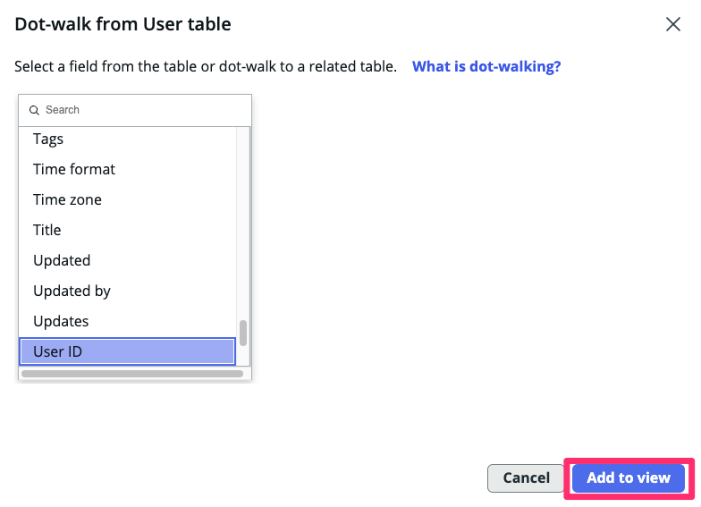
   **Resultado:** O campo **User ID** foi adicionado ao formulário.

Um campo adicionado. 
* ~~Host ID~~
* Host Email
* Host Location

1. **Adicione o campo 'Host Email' ao formulário.**
   1. Passe o cursor sobre o campo 'Host Name' até que o botão "+Add" apareça e clique no botão abaixo do campo.
   
   2. Encontre o campo Host Name e selecione a opção abaixo "Add a related field"
   
   3. Agora você pode navegar por todos os campos da tabela user do Host.
   4. Digite "Email" e selecione a opção correspondente.
   5. Clique em Add to view.
   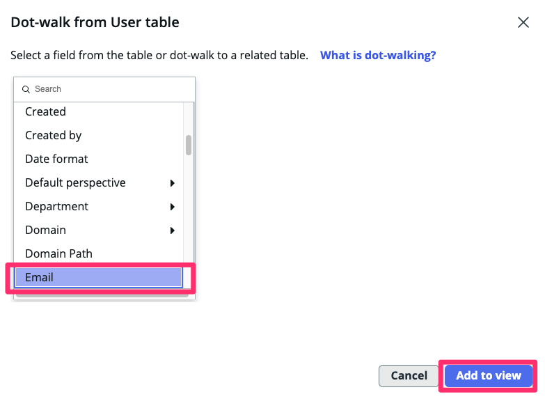
   **Resultado:** O campo **Email** foi adicionado ao formulário.

Dois campos adicionados. 
* ~~Host ID~~
* ~~Host Email~~
* Host Location

1. **Adicione o campo 'Host Location' ao formulário.**
   1. Passe o cursor sobre o campo 'Host Email' até que o botão "+Add" apareça e clique no botão abaixo do campo.
   
   2. Encontre o campo Host Location e selecione a opção abaixo "Add a related field"
   
   3. Agora você pode navegar por todos os campos da tabela user do Host.
   4. Digite "Location" e selecione a opção correspondente.
   5. Clique em Add to view.
   
      **Resultado:** O campo **Location** foi adicionado ao formulário.

Três campos adicionados. 
* ~~Host ID~~
* ~~Host Email~~
* ~~Host Location~~

1. Passe o mouse na área vazia do form até que apareça a opção abaixo `+ Add section` e clique nela
   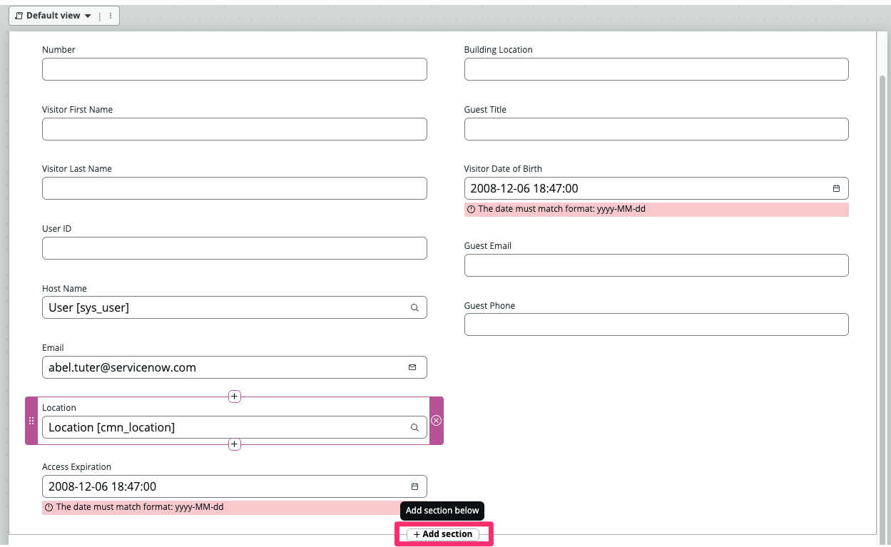

2. Clique na nova sessão carregada abaixo.
   

3. No painel lateral da direita, altere o campo `Section Label` para Host e o campo `Section layout` para "Two columns" e clique em "Merge with section above".
   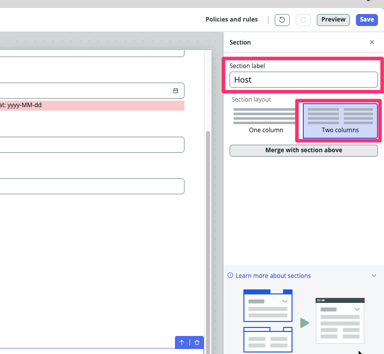

4. Agora mova para os espaços da sessão abaixo todos os campos do Host arrastando na área chanfrada do campo. Campos: `User ID`, `Host Name`, `Email`, `Location`
   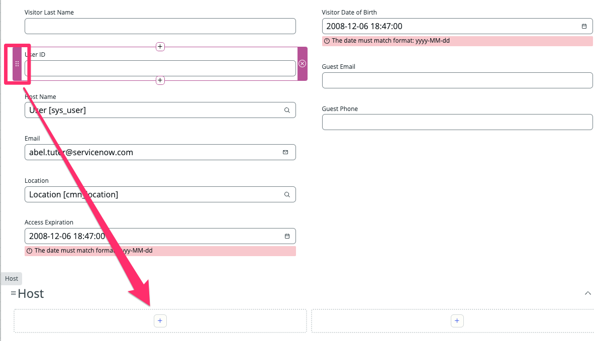
   

Antes de finalizarmos, seria importante poder acompanhar o status de cada etapa. Para isso vamos adicionar os seguintes campos a nossa tabela e formulário:
   - Check-in Visitante
   - Pré-Cadastro Validado
   - Crachá Emitido

1. Vamos adicionar o campo `Check-in Visitante`. Clique em **+ Add a field in the table**
    

2. Preencha os valores e clique em Add
   
    | Campo | valor |
    |-------|-------|
    | (1) Column label | Check-in Visitante |
    | (2) Column name | check_in_visitante |
    | (3) Type | True/False |

    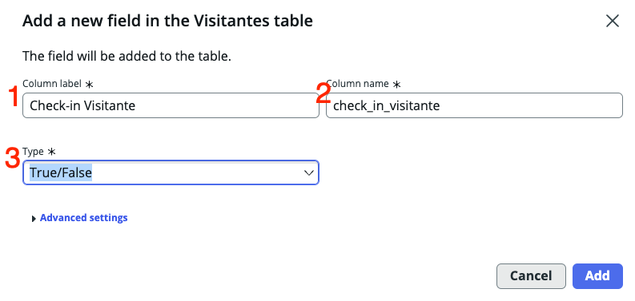

3. Clique em `Add anothe one`
   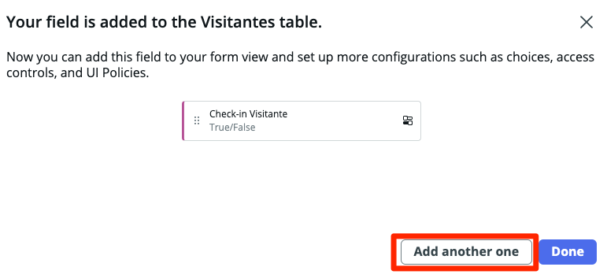

4. Preencha os valores e clique em Add
   
    | Campo | valor |
    |-------|-------|
    | (1) Column label | Pré-Cadastro Validado |
    | (2) Column name | pre_cadastro_validado |
    | (3) Type | True/False |

    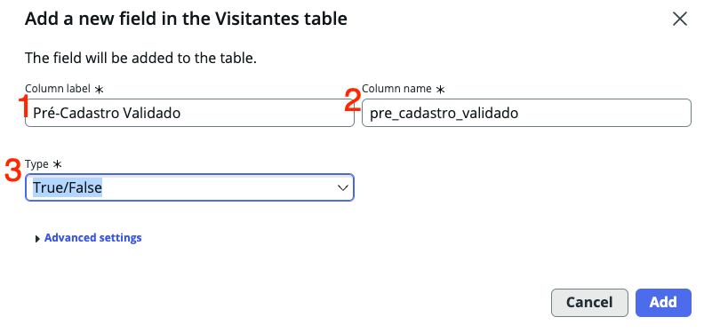

5. Clique em `Add anothe one`

6. Preencha os valores e clique em Add
   
    | Campo | valor |
    |-------|-------|
    | (1) Column label | Crachá Emitido |
    | (2) Column name | cracha_emitido |
    | (3) Type | True/False |

    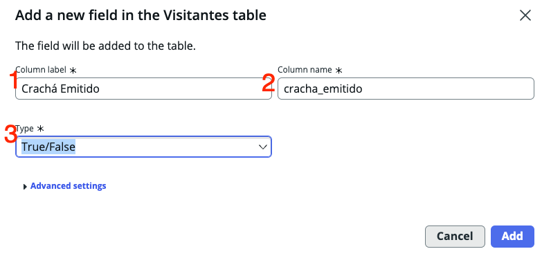

7. Clique em Done

8. Arraste os três novos campos para dentro do formulário. Fique à vontade para ajustar o layout como quiser.
   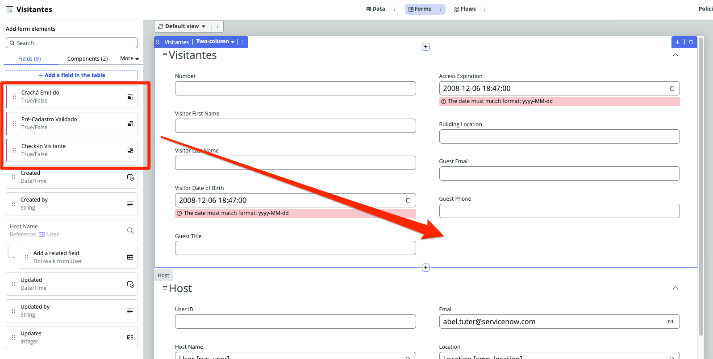
   

9.  **Salve seu trabalho.**
   * Clique em Save no canto superior direito.
   

10. **Volte para a visualização 'Data -> Spreadsheet'.**
    1. Clique nos três pontos ao lado do pill **Data**.
    2. Clique em **Spreadsheet**.
   

11. Clique no ícone de escape ao lado de um registro para abri-lo.
   

12. **Confirme que o novo formulário atende aos requisitos dos usuários fulfillers.**
    * Verifique o novo formulário para a tabela `Visitantes`.
    * Agora deve ter os quatro campos solicitados pelos nossos **fulfillers** no formulário.
      * Host ID
      * Host Email
      * Host Location
    

    _Se você não vê os campos no formulário, por favor, revise os passos anteriores ou peça ajuda ao seu instrutor._

13. Feche a aba Record.

14. Feche a aba **Data Table and Forms**.

### Você deve estar agora na página **App Home**.
  

## Recapitulação do Exercício

🎉 Parabéns você acaba de criar uma aplicação simples em ServiceNow que possui uma tabela e formulário para gerenciar os acessos de visitantes.
