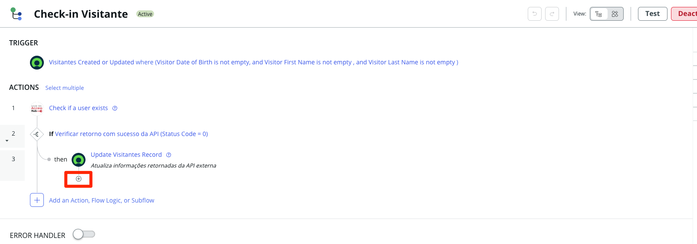
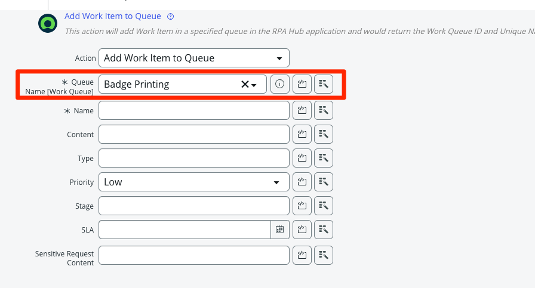
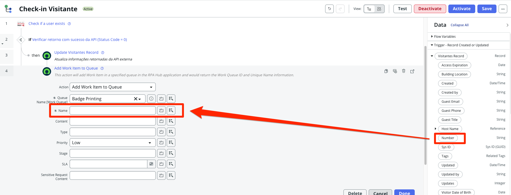
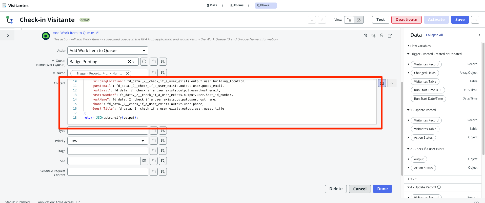
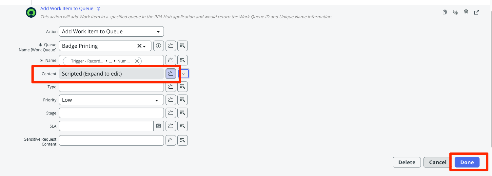
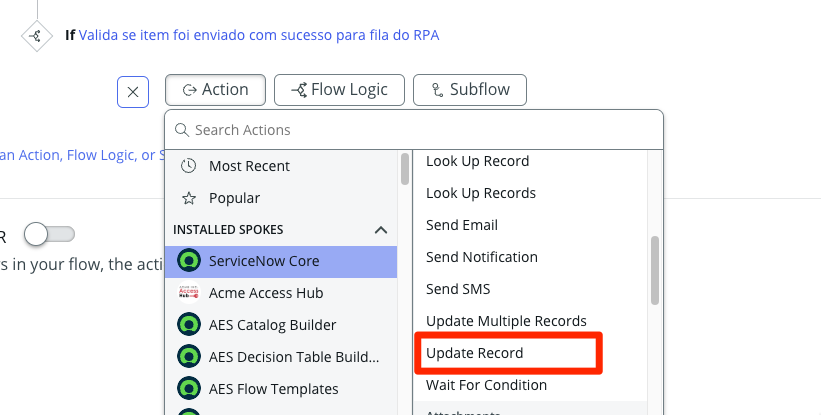
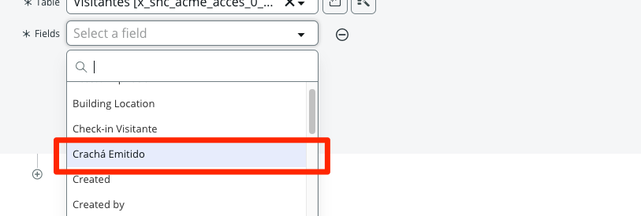
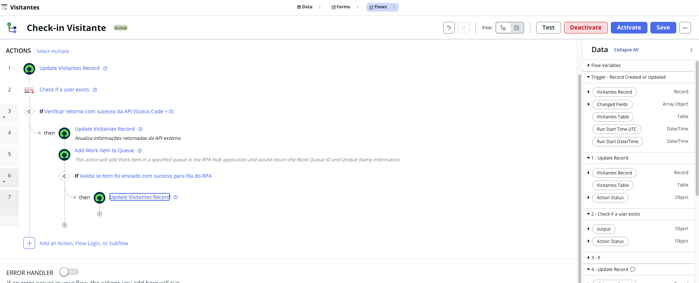

Agora para integrarmos todo o processo de fim-a-fim vamos editar o fluxo `Check-in Visitante` para que ele adicione um item a fila do RPA para que ele faça a impressão do crachá de visitante.

1. Retorne para o App Engine Studio. Caso tenha fechado a janela do AES, acesse sua Instância de laboratório e navegue até o **AES (App Engine Studio)** em `All > App Engine > App Engine Studio`. e acesse a aplicação `Acme Access Hub`.


2. Na aba Página Inicial do App, na seção "Lógica e automação", selecione o fluxo `Check-in Visitante`.
    

3. Mude a visão do fluxo clicano no ícone.
    

4. Adicione uma nova action após o `Update Visitantes Record`
    

5. Selecione a action **RPA Hub > Add Work Item to Queue**
   

6. No campo **Queue Name [Work Queue]** selecione **Badge Printing**
   

7. Para o campo **Name** arraste o Data Pill **Visitantes Record > Number**
    

8. No campo **Content** clique no ícone de scripting.
   

9. Copie e cole o código abaixo:

    ```javascript
        /*
        **Access Flow/Action data using the fd_data object. Script must return a value. 
        **Order number is offset by +1 in Error Handling Section.
        **Available options display upon pressing "." after fd_data
        **example: var shortDesc = fd_data.trigger.current.short_description;
        **return shortDesc;
        */
        var output = {
            "AccessExpirationDate": fd_data._2__check_if_a_user_exists.output.user.access_expiration,
            "BuildingLocation": fd_data._2__check_if_a_user_exists.output.user.building_location,
            "guestemail": fd_data._2__check_if_a_user_exists.output.user.guest_email,
            "HostEmail": fd_data._2__check_if_a_user_exists.output.user.host_email,
            "HostIdNumber": fd_data._2__check_if_a_user_exists.output.user.host_id_number,
            "HostName": fd_data._2__check_if_a_user_exists.output.user.host_name,
            "phone": fd_data._2__check_if_a_user_exists.output.user.phone,
            "Guest Title": fd_data._2__check_if_a_user_exists.output.user.guest_title
        };
        return JSON.stringify(output);
    ```

    :::danger
    Valide a ordem das actions está igual as imagens, especialmente se no painel lateral do data pill a action "2 - Check if a user exists" está na ordem 2. Caso não esteja o script acima não irá funcionar.
        
    :::

    

10. Clique no ícone para colapsar o campo de script.
    

11. Clique em <span className="button-purple">Done</span>:
    

    :::info
    O uso de código neste caso facilita na preparação fo payload para o RPA que espera um array JSON para processar as informações.
    :::

12. Agora vamos adicionar uma condição If para validar a adição do item a fila de trabalho do RPA. Clique em **Flow Logic** abaixo do **Add Work Item to Queue** e selecione **If**
    
    

13. No **Condition Label** adicione `Valida se item foi enviado com sucesso para fila do RPA`
    

14. Arraste o data pill **5 - Add Work Item to Queue > status** para **Condition 1**
    

15. Preencha a condição:
    
    |**Campo** | **Operador** | **Lógica** |
    |-|-|-|
    |**status** | is | Success |

    

16. Abaixo da condição If criada, adicione uma **Action**
    

17. Selecione a action **ServiceNow Core > Update Record**
    

18. Arraste o data pill **Visitantes Record** para o campo **Record**
    

19. Clique em **+ Add field value** e selecione o campo **Crachá Emitido** e marque a caixa de seleção.
    

20. Clique em <span className="button-purple">Done</span>
    

21. No canto superior direito da tela, clique em <span className="button-purple">Save</span>.

22. Clique em <span className="button-purple">Activate</span> à esquerda do botão Save. Isso torna o Fluxo 'ativo' no aplicativo.  

23. Na caixa de Confirmação, clique no botão <span className="button-purple">Activate</span>.

### Seu fluxo deve se parecer com isso:



## Recapitulação do Exercício

Nós integramos o processo de RPA de impressão de crachá ao fluxo da nossa aplicação. 

A seguir, você irá testar o Fluxo para vê-lo em ação.